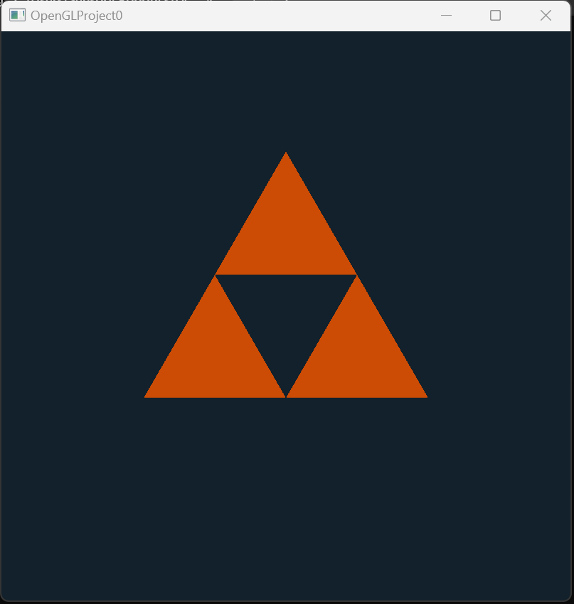

# OpenGL implementations

This project serves as my exposure to the [OpenGL framework](https://www.opengl.org/) in C++, and simultaneously to [GLFWG](https://www.glfw.org/) and [glad](https://glad.dav1d.de/).  of these libraries have already been loaded into this project, so that saves you the hassle of installing them.

## GLFW (Graphics Library FrameWork)

-GLFW provides us with the bare necessities required for rendering objects to the screen. OpenGL itself does not have rendering functionalities.

## GLAD

-[GLAD](https://www.khronos.org/opengl/wiki/OpenGL_Loading_Library#glad_(Multi-Language_GL/GLES/EGL/GLX/WGL_Loader-Generator)) is a [Loader-Generator](https://github.com/Dav1dde/glad) for the OpenGL framework.

-There are multiple versions of OpenGL. The location of most of its functions is not known at compile-time and needs to be queried at run-time. GLFW helps us at compile-time only. This is where glad comes into the picture. GLAD manages function pointers for OpenGL (OpenGL LOVES using pointers and references for its methods)

-Created the Triforce! 

